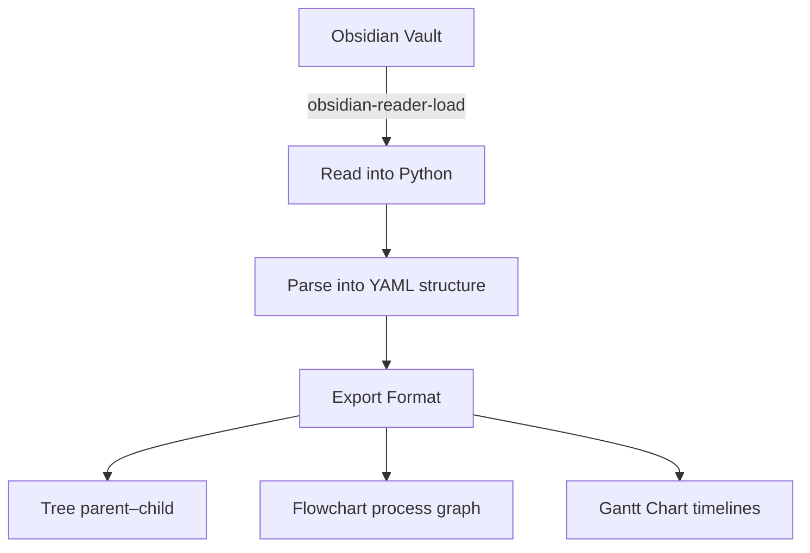

```mermaid
flowchart TD
    A[Obsidian Vault] -->|obsidian-reader-load| B[Read into Python]
    B[Read into Python] --> C[Parse into YAML structure]
    C --> D[Export Format]
    D --> E[Tree parent–child]
    D --> F[Flowchart process graph]
    D --> G[Gantt Chart timelines]
```

