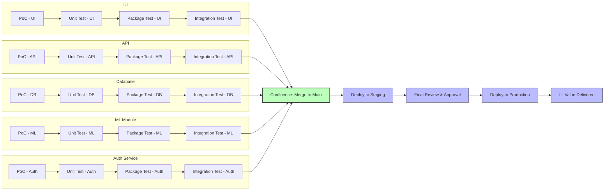

```mermaid
flowchart LR
    %% Component Pipelines
    subgraph UI_Component [UI]
        UI1[PoC - UI] --> UI2[Unit Test - UI] --> UI3[Package Test - UI] --> UI4[Integration Test - UI]
    end

    subgraph API_Component [API]
        API1[PoC - API] --> API2[Unit Test - API] --> API3[Package Test - API] --> API4[Integration Test - API]
    end

    subgraph DB_Component [Database]
        DB1[PoC - DB] --> DB2[Unit Test - DB] --> DB3[Package Test - DB] --> DB4[Integration Test - DB]
    end

    subgraph ML_Component [ML Module]
        ML1[PoC - ML] --> ML2[Unit Test - ML] --> ML3[Package Test - ML] --> ML4[Integration Test - ML]
    end

    subgraph AUTH_Component [Auth Service]
        AUTH1[PoC - Auth] --> AUTH2[Unit Test - Auth] --> AUTH3[Package Test - Auth] --> AUTH4[Integration Test - Auth]
    end

    %% Merge Point
    UI4 --> Merge[Confluence: Merge to Main]
    API4 --> Merge
    DB4 --> Merge
    ML4 --> Merge
    AUTH4 --> Merge

    %% Downstream Flow
    Merge --> Stage[Deploy to Staging]
    Stage --> Review[Final Review & Approval]
    Review --> Prod[Deploy to Production]
    Prod --> Value[📈 Value Delivered]

    %% Styling (optional: for clarity)
    classDef test fill:#f9f,stroke:#333,stroke-width:1px;
    classDef deploy fill:#bbf,stroke:#333,stroke-width:1px;
    classDef merge fill:#bfb,stroke:#222,stroke-width:2px;
    class Merge merge;
    class Stage,Review,Prod,Value deploy;

```

