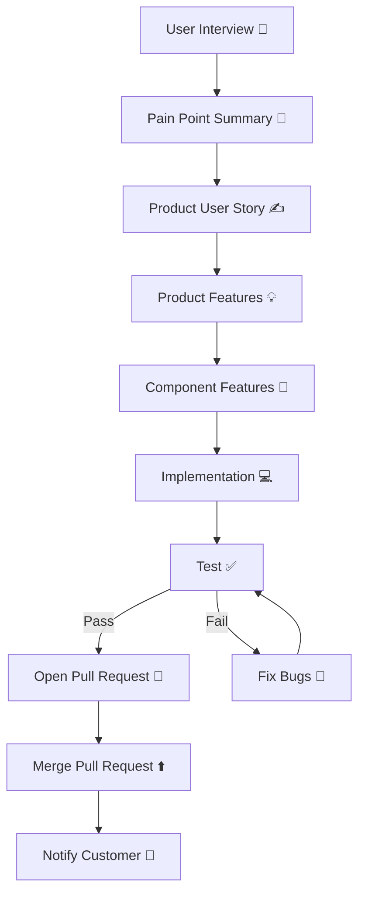
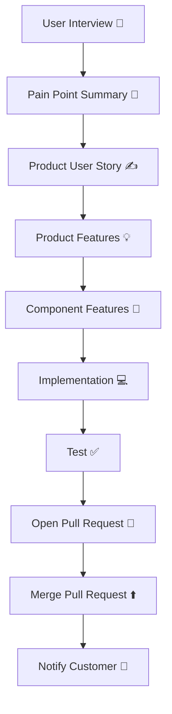

```mermaid
flowchart TD
    A[User Interview 🎤] --> B[Pain Point Summary 🧠]
    B --> C[Product User Story ✍️]
    C --> D[Product Features 💡]
    D --> E[Component Features 🔧]
    E --> F[Implementation 💻]
    F --> G[Test ✅]

    G -->|Pass| H[Open Pull Request 🔁]
    G -->|Fail| F2[Fix Bugs 🐛]
    F2 --> G

    H --> I[Merge Pull Request ⬆️]
    I --> J[Notify Customer 📣]
```

```mermaid
flowchart TD
    A[User Interview 🎤] --> B[Pain Point Summary 🧠]
    B --> C[Product User Story ✍️]
    C --> D[Product Features 💡]
    D --> E[Component Features 🔧]
    E --> F[Implementation 💻]
    F --> G[Test ✅]
    G --> H[Open Pull Request 🔁]
    H --> I[Merge Pull Request ⬆️]
    I --> J[Notify Customer 📣]
```
