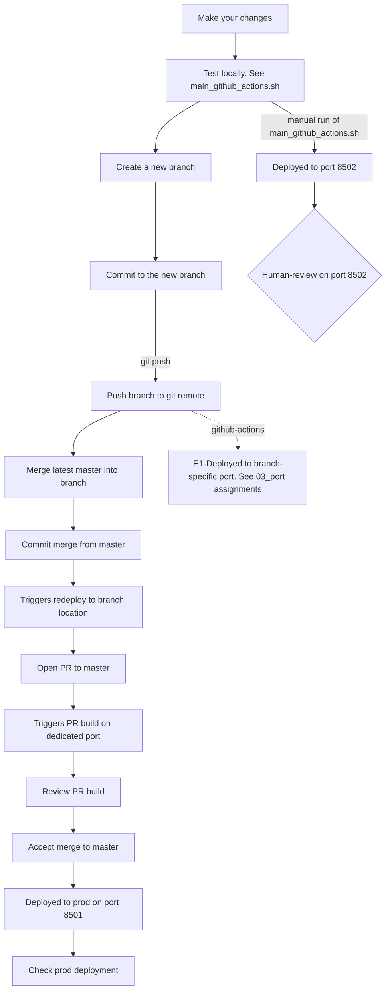

## Daily work
**Local test**
If no changes to dockerfile, main-github-actions.sh, or new python packages:
		- then no need to rebuild container:
	If dockerfile has changed, need to rebuild container:
		- [[00a_container rebuild]]
	If new python package has been added, need to regenerate environment.yml AND recreate the container
		- [[Recreate environment.yml]]
		- [[00a_container rebuild]]

To deploy the app locally (on dev port 8502) run *main-github-actions.sh*
## Nominal merge process
- Make your changes
- Test locally:
	- From repo root, run: *./main_github_actions.sh*
		- This will deploy (locally) to port 8502. See [[03_port assignments]]
	- When you think it's working.
- Create a new branch
- Commit to the new branch
- Push
	- This will deploy to a branch location. See [[03_port assignments]]
	- Check the branch.
- Merge latest master into your branch. 
- Commit master -> this should redeploy to the branch location
- Open up the PR to master -> this should make a dedicated PR build (on a different port)
- Review the PR build.
- Accept the merge -> this should deploy to prod.
- Check prod (i.e. port 8501) is good.

