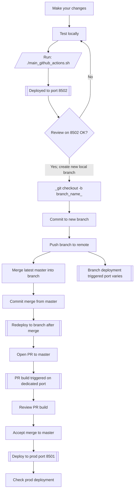

```mermaid
flowchart TD
    %% Developer Actions
    A[Make your changes]
    B[Test locally]
    C[_git checkout -b branch_name_]
    D[Commit to new branch]
    E[Push branch to remote]
    F[Merge latest master into branch]
    G[Commit merge from master]
    H[Open PR to master]
    I[Review PR build]
    J[Accept merge to master]
    L[Check prod deployment]

    %% Commands and Automation
    B1[/Run: ./main_github_actions.sh/]
    B2[[Deployed to port 8502]]
    B3{Review on 8502 OK?}

    E1[[Branch deployment triggered port varies]]
    G1[[Redeploy to branch after merge]]
    H1[[PR build triggered on dedicated port]]
    K[[Deploy to prod port 8501]]

    %% Flow connections
    A --> B --> B1 --> B2 --> B3
    B3 -->|Yes; create new local branch| C
    B3 -->|No| B

    C --> D --> E
    E --> E1
    E --> F --> G --> G1
    G1 --> H --> H1 --> I --> J --> K --> L

```

