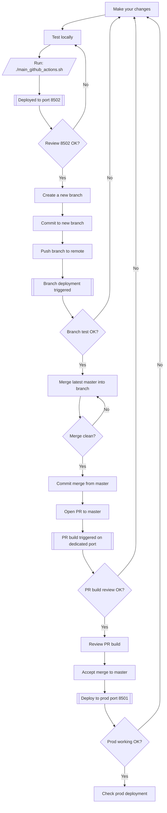

```mermaid
flowchart TD
    %% Developer Actions
    A[Make your changes]
    B[Test locally]
    C[Create a new branch]
    D[Commit to new branch]
    E[Push branch to remote]
    F[Merge latest master into branch]
    G[Commit merge from master]
    H[Open PR to master]
    I[Review PR build]
    J[Accept merge to master]
    L[Check prod deployment]

    %% Commands and Automation
    B1[/Run: ./main_github_actions.sh/]
    B2[[Deployed to port 8502]]
    B3{Review 8502 OK?}

    E1[[Branch deployment triggered]]
    E2{Branch test OK?}

    F1{Merge clean?}

    H1[[PR build triggered on dedicated port]]
    H2{PR build review OK?}

    K[[Deploy to prod port 8501]]
    K1{Prod working OK?}

    %% Flow connections
    A --> B --> B1 --> B2 --> B3
    B3 -->|Yes| C
    B3 -->|No| B

    C --> D --> E --> E1 --> E2
    E2 -->|Yes| F
    E2 -->|No| A

    F --> F1
    F1 -->|Yes| G
    F1 -->|No| F

    G --> H --> H1 --> H2
    H2 -->|Yes| I --> J --> K --> K1
    H2 -->|No| A

    K1 -->|Yes| L
    K1 -->|No| A
```

