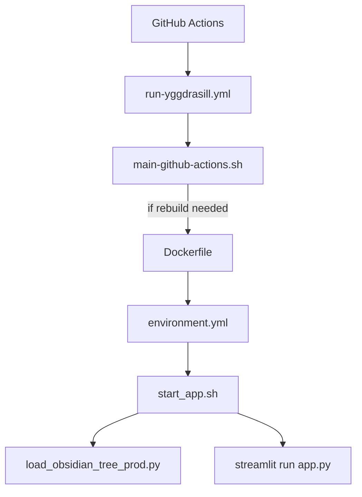

### 🔍 Description of the Flow

- **GitHub Actions** runs `run-yggdrasill.yml` on events (PRs, pushes, etc.)
    
- That calls your `main-github-actions.sh` entrypoint.
    
- If the hash of `Dockerfile` or `environment.yml` has changed, it rebuilds.
    
- The `Dockerfile` uses `environment.yml` to create the conda environment.
    
- The container entrypoint is `start_app.sh`, which:
    
    - Loads data with `load_obsidian_tree_prod.py`
        
    - Starts the app with `streamlit run app.py`
        

Let me know if you want to add _port logic_ or _PR vs branch vs prod_ branches to the diagram.