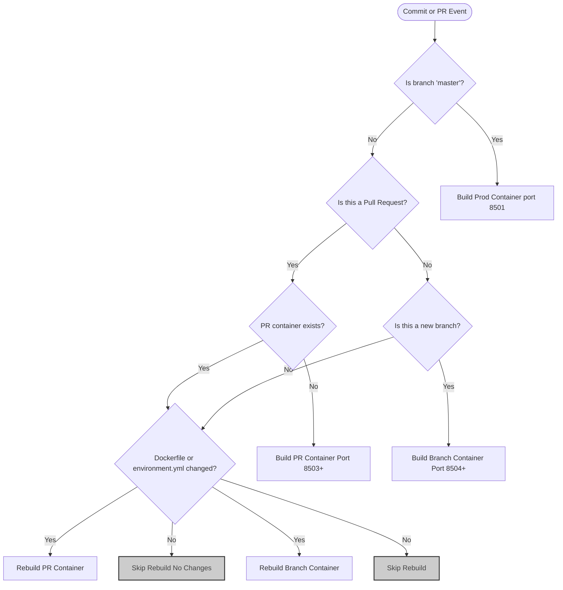

```mermaid

flowchart TD
    Start([Commit or PR Event])
    IsMaster{Is branch 'master'?}
    IsPR{Is this a Pull Request?}
    IsNewBranch{Is this a new branch?}
    DockerfileChanged{Dockerfile or environment.yml changed?}

    Start --> IsMaster
    IsMaster -- Yes --> BuildProd[Build Prod Container port 8501]
    IsMaster -- No --> IsPR

    IsPR -- Yes --> PRContainerExists{PR container exists?}
    PRContainerExists -- No --> BuildPR[Build PR Container Port 8503+]
    PRContainerExists -- Yes --> DockerfileChanged
    DockerfileChanged -- Yes --> RebuildPR[Rebuild PR Container]
    DockerfileChanged -- No --> SkipPR[Skip Rebuild No Changes]

    IsPR -- No --> IsNewBranch
    IsNewBranch -- Yes --> BuildBranch[Build Branch Container Port 8504+]
    IsNewBranch -- No --> DockerfileChanged
    DockerfileChanged -- Yes --> RebuildBranch[Rebuild Branch Container]
    DockerfileChanged -- No --> SkipBranch[Skip Rebuild]

    classDef skip fill:#ccc,stroke:#333,stroke-width:2px,color:#444
    class SkipPR,SkipBranch skip

```

