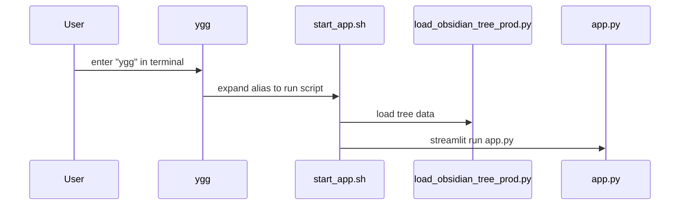

**Start the streamlit app python code** 
In the terminal:
```bash
conda activate sfs &&
cd ~/git/yggdrasill/yggdrasill/app/hlidskjalf/src/ &&
streamlit run app.py
```

# Diagram
WARNING -> THIS DIAGRAM MAINTAINED MANUALLY

